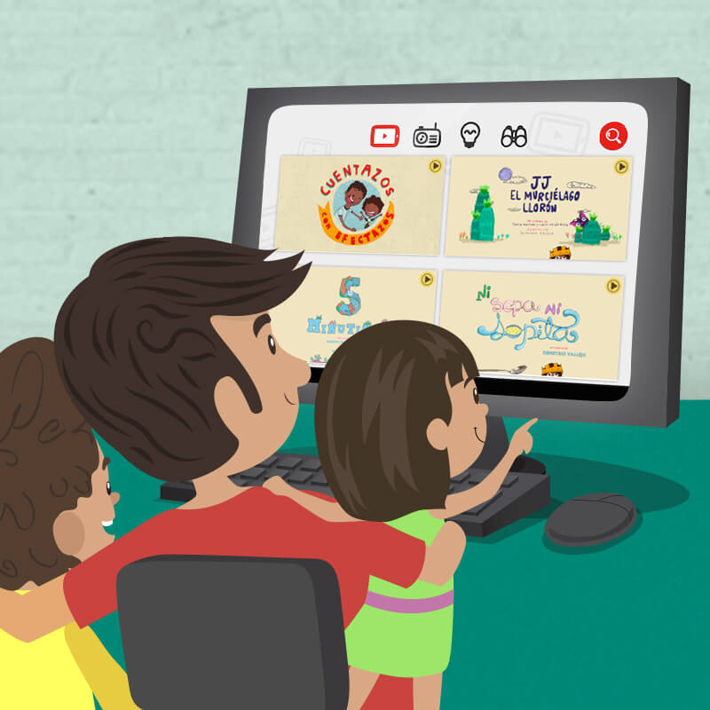
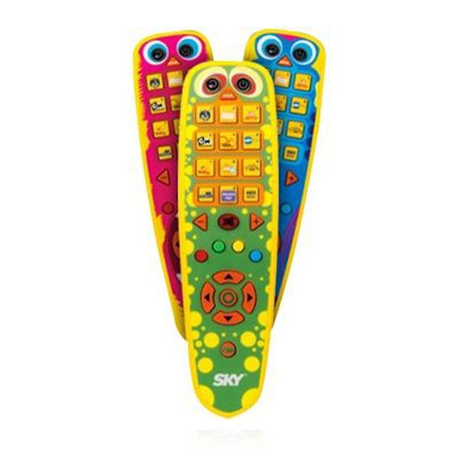
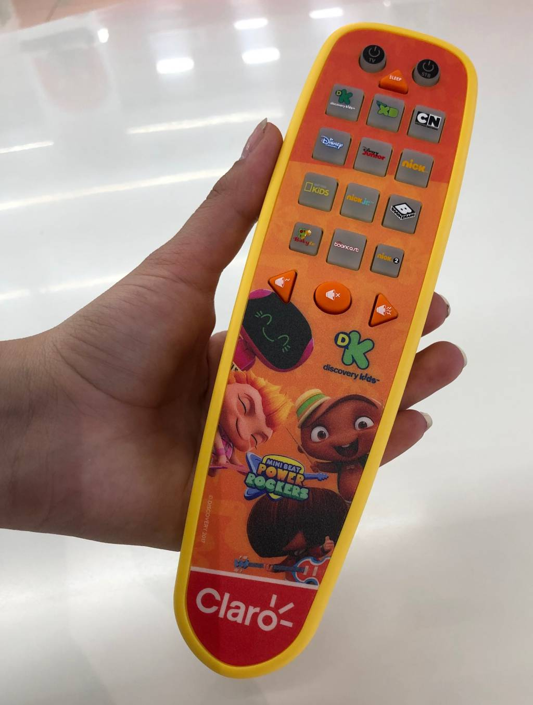
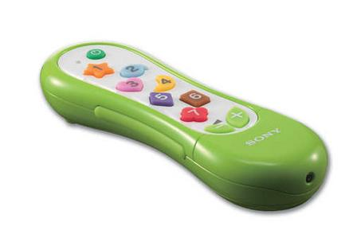

# Control remoto para el pequeñ@ de la casa.

En pocas palabras estamos buscando diseñar y crear un control remoto simple para el pequeño de la casa además de una interfaz que se pueda adaptar a ellos.



## Problematica 📋📋📋

```js
Esto esta inspirado en mi sobrina("Zoe") y mi madre("Isabel").

Cada vez que "Zoe" quiere que le cambien de dibujo aveces estamos ocupados.

Y por que no le damos el control para que ella misma lo cambie

Esa es la solución que ella misma cambie sus dibujos 😀 pero también es el problema, el control tiene muchos botones, además que la interfaz no se adapta y ni es sencilla.
```

## 🔧 No es dificil 🔧

Solo necesitariamos lo siguiente:

- Control remoto
- Interfas para pequeños

## 🚀 Esto se puede mejorar con el tiempo. 🚀


 


